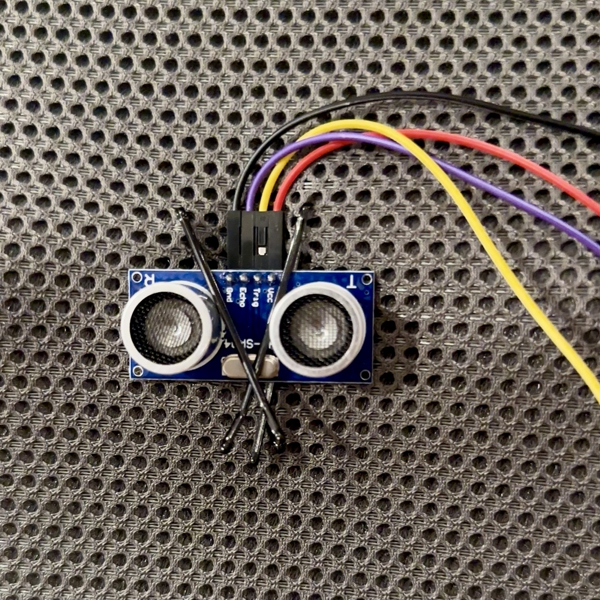
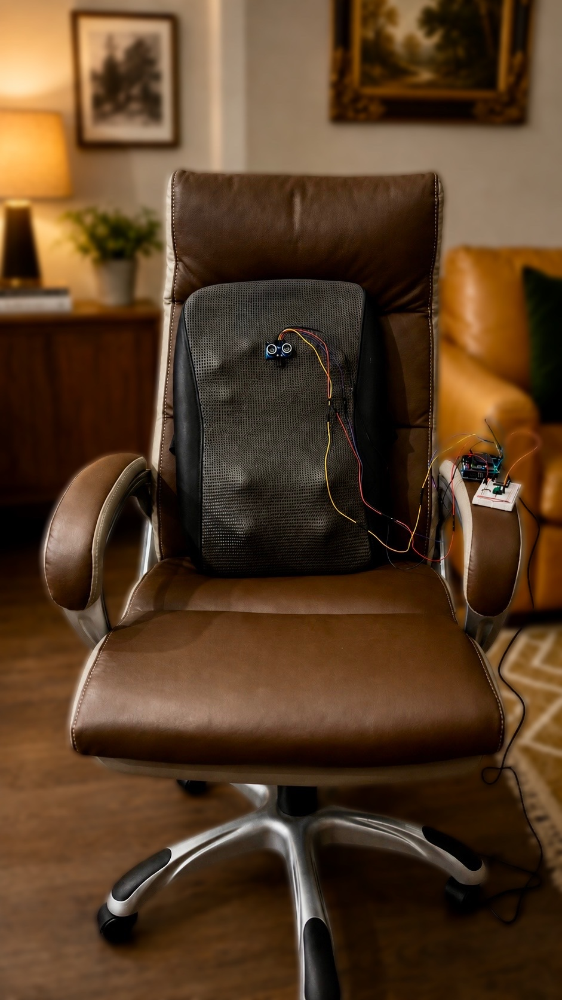
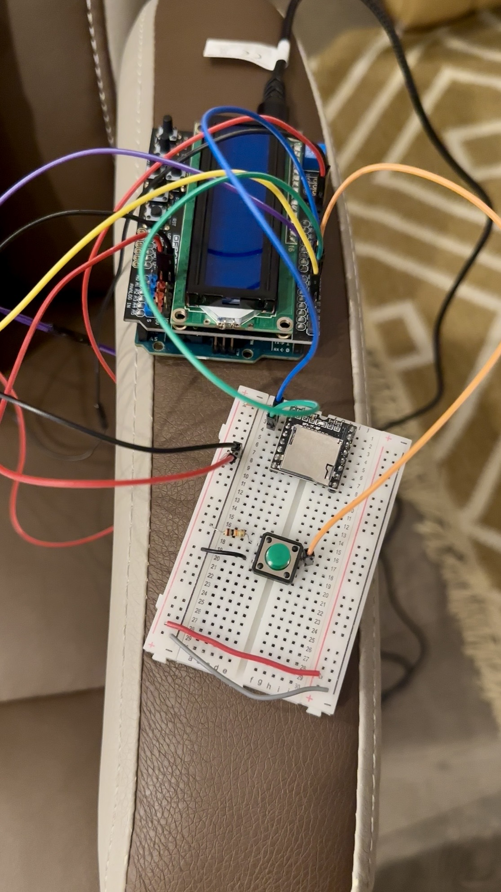

# Posture Pilot

## Overview

Posture Pilot is an embedded ergonomic monitoring system designed to help users maintain healthy sitting posture while studying, coding, gaming, or working at a desk.

The system mounts an ultrasonic distance sensor on the backrest of a chair and continuously measures the distance between the chair and the user's back. After a one-time calibration step, Posture Pilot tracks posture drift relative to the user's personal baseline and detects slouching behavior in real time.

When prolonged slouching is detected, the system provides visual feedback through an LCD display and audio reminders through an MP3-TF-16P audio playback module and speaker.

## Motivation

Many students and engineers spend hours sitting at a desk and gradually develop poor posture without realizing it. Existing posture-monitoring products are often expensive, require wearable hardware, or rely on cameras that introduce privacy concerns.

As an engineering student, I spend long hours sitting while studying and working on projects. Over time, this led to noticeable middle back pain and eventually required a doctor visit. That experience made posture feel less like a small habit issue and more like a real health problem worth addressing early.

Posture Pilot explores a low-cost embedded alternative using simple distance sensing and personalized calibration to provide posture awareness without requiring computer vision or wearable electronics.

## Features

- Real-time posture monitoring
- Personalized posture calibration
- Chair-mounted sensing system
- LCD status display
- Voice-based posture reminders
- Adjustable slouch threshold
- Fully standalone embedded system

## Hardware Components

### Core Components

- Arduino Uno R3
- LCD Keypad Shield
- HC-SR04 Ultrasonic Sensor
- MP3-TF-16P Audio Module
- Small Speaker
- Breadboard
- Jumper Wires

### Optional

- External battery pack
- Chair mounting bracket
- 3D printed enclosure

## System Architecture

```text
            User
              ^
              |
              |
    HC-SR04 Ultrasonic Sensor
       Mounted on Chair Back
              |
              v
         Arduino Uno
         /         \
        v           v
   LCD Shield    MP3-TF-16P
                      |
                      v
                   Speaker
```

## Wiring

### HC-SR04 Ultrasonic Sensor

| HC-SR04 | Arduino Uno |
|---|---|
| VCC | 5V |
| GND | GND |
| TRIG | D3 / PD3 |
| ECHO | D2 / PD2 |

### MP3-TF-16P

| MP3-TF-16P | Arduino Uno |
|---|---|
| VCC | 5V |
| GND | GND |
| RX | D11 / PB3 through 1k ohm resistor |

The current code only transmits commands from the Arduino to the MP3 module. The MP3 `TX` pin is not used right now.

### Speaker

| Speaker | MP3-TF-16P |
|---|---|
| Positive | SPK_1 |
| Negative | SPK_2 |

### LCD Shield

The LCD Keypad Shield plugs directly onto the Arduino Uno and provides:

- 16x2 LCD display
- `SELECT` button used for calibration
- Built-in navigation buttons

LCD wiring follows the pin mapping used by [lcd.c](lcd.c), and the `SELECT` button is read on `A0 / ADC0`.

## Calibration Procedure

1. Sit upright in your chair.
2. Press the LCD shield `SELECT` button.
3. Posture Pilot stores the current distance measurement as the baseline posture.
4. The system announces: `Calibration complete.`
5. Continuous posture monitoring begins.

## Detection Logic

The HC-SR04 continuously measures the distance between the chair back and the user's back.

### Good Posture

`Current Distance ~= Baseline Distance`

LCD:

`Posture Good`

`Score: 95%`

### Slouching

`Current Distance > Baseline Distance`

When the distance exceeds the configured threshold:

LCD:

`SLOUCHING!`

`Score: 42%`

Audio:

`Please sit upright.`

## Audio Prompts

Stored on the microSD card connected to the MP3-TF-16P module.

```text
/mp3/0001.mp3  Please sit upright.
/mp3/0002.mp3  Calibration complete.
```

These two prompts match the current code:

- Track `1`: slouch warning
- Track `2`: calibration complete

## Example LCD Screens

### Startup

```text
Posture Pilot
Press SELECT
```

### Calibrated

```text
Calibrated!
Base: 14 cm
```

### Good Posture

```text
Posture Good
Score: 94%
```

### Slouching

```text
SLOUCHING!
Score: 51%
```

## Current Progress

The initial design is finished. I used a massage back pad and a hair clip to secure the ultrasonic sensor to the chair back, and the breadboard and Arduino are mounted on the chair arm. I am still waiting for the speaker and TF card to arrive.

### Ultrasonic Sensor Mounted on the Back Pad



### Full Chair Setup



### Breadboard and Arduino on Chair Arm



## Cost Table

| Item | Unit Cost | Notes | Link |
|---|---:|---|---|
| Ultrasonic Distance Sensor - 5V (HC-SR04) | $5.25 | Single sensor | [SparkFun](https://www.sparkfun.com/ultrasonic-distance-sensor-hc-sr04.html) |
| MP3-TF-16P | $1.75 | Calculated from $13.99 for 8 pieces | [Amazon](https://www.amazon.com/Yuuhseel-Player-Support-Compatible-DFPlayer/dp/B0G133NWK3/ref=sr_1_1_sspa?crid=LT0E1SVX54BU&dib=eyJ2IjoiMSJ9.H0jpaE0ezUCMJNWoRgfomFCbnXaH14IgV1fY5wK6_3gEullOGD34a0hsuDnfRww46G5lbXlxsXnub8Tar6oA5QjrJAw4n0BB9_jbHabY1N5jCYA3zNQ8-ZnKliPtOSNHd7n_a7gm7CVLo11NCWqsQrXpwiciMUMqrATHGz77Jarr2RFBgtxGwUUh5F4kkV_m488hJ2SB2yDmdYnKpJn3fPEv58UoXlCHm214um-d8H8.sKYE_tEpR9mL1udf5tpWVm9iruptCX2BJWyZTqRHs8&dib_tag=se&keywords=MP3-TF-16P&qid=1780804720&sprefix=%2Caps%2C172&sr=8-1-spons&sp_csd=d2lkZ2V0TmFtZT1zcF9hdGY&psc=1) |
| Small speaker | $1.50 | Calculated from $8.99 for 6 pieces | [Amazon](https://www.amazon.com/dp/B09MRK24PP?ref=ppx_yo2ov_dt_b_fed_asin_title&th=1) |
| TF card | $9.50 | Single card | N/A |
| 1602 LCD Keypad Shield for Arduino | $9.90 | Single unit | [DigiKey](https://www.digikey.com/en/products/detail/dfrobot/DFR0009/7597118?so=98720144&content=productdetail_row&mkt_tok=MDI4LVNYSy01MDcAAAGhPfLEqpM2lLR6KASRUN78ibixmfFmJAGMbjnvwCN-sx2UC8WJq3Vyp58bAfi6u29iFtyrukjS05FqgW1wGS4EKDaJKCcMvChPn558nLkDb9g) |
| Arduino Uno R3 ATmega328P board | $27.60 | Single board | [DigiKey](https://www.digikey.com/en/products/detail/arduino/A000066/2784006?so=98720144&content=productdetail_row&mkt_tok=MDI4LVNYSy01MDcAAAGhPfLEqjvMaCWBQzWS6pyKdkj6A046_sR2P6MLYOB1pscW2D-1i5ohHERtZRA0Piug_8kmyllGEOJZGrbs2klqcQNpykopjkmMgRxSeQ3mSBg) |

**Estimated total cost:** `$55.50`

## Technologies

- Embedded C
- ATmega328P
- Arduino Uno R3
- Ultrasonic sensing
- Serial communication
- MP3 audio playback
- Real-time monitoring
- Human factors engineering

## Acknowledgment

I learned much of the low-level embedded programming style used in this project through USC's EE109 course, especially topics such as LCD interfacing and pin change interrupts. If you are interested in the course material and lab structure, you can read through the EE109 lab page here:

[USC EE109 Labs](https://bytes.usc.edu/ee109/labs/)

## Current Code Wiring Summary

- LCD: uses the existing [lcd.c](/Users/harvardsummer/Library/Mobile%20Documents/com~apple~CloudDocs/GitHub/PosturePilot/lcd.c) shield wiring
- LCD `SELECT` button: `A0 / ADC0`
- HC-SR04 `TRIG`: `D3 / PD3`
- HC-SR04 `ECHO`: `D2 / PD2`
- MP3-TF-16P `RX`: `D11 / PB3` through `1k` resistor
- MP3-TF-16P `TX`: not used in the current code

2026 copyright wuisabel-gif
